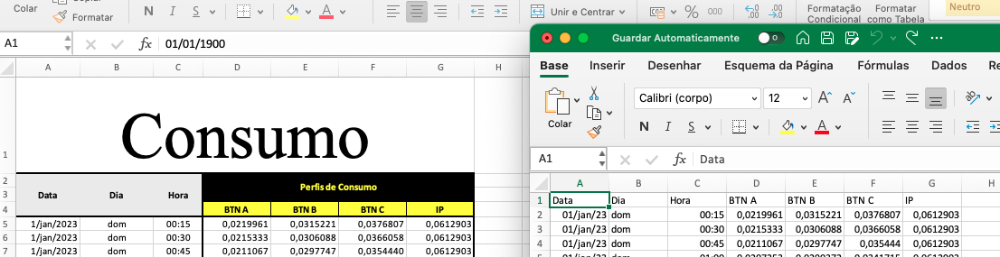

# Exemplos

Os dois exemplos existentes são para uma análise com e sem bateria. O consumo é previsto através de
perfis médios da Eredes e a produção através do portal PVGIS.

## Consumo

O ficheiro com perfis de consumo para 2023 pode ser descarregado [aqui](https://www.e-redes.pt/pt-pt/perfis-de-consumo) à data de acesso 26-08-2024.

É necessário converter o ficheiro de xlsx para csv, é esperado que o separador do csv seja ``;``pois esse é o separador que o excel utiliza. 

É também necessário processar o cabeçalho para que o original à esquerda fica no formato à direita na imagem seguinte.


### Segmentacao perfis E-redes

Posteriormente é necessário escolher o perfil a utilizar, que deve ser escolhido a partir da seguinte tabela:

| | Potencia Contratada (kVA) | Energia (kWh) | Opção |
|--|---|--|--|
| Classe A |  > 13.8 | Qualquer | 'BTN A' |
| Classe B | <= 13.8 | > 7140 | 'BTN B' |
| Classe C | <= 13.8 | <= 7140 | 'BTN C' |

### Ajuste do perfil ao consumo anual

O perfil escolhido é ajustado ao valor de consumo anual através da formula:

```{math}
Perfil_{Ajustado} = \frac{Perfil_{E-Redes}*Consumo_{Anual}}{1000}
```

```{nbgallery}
./dados_consumo
```

## Produção

Os dados de produção são obtidos da API [PVGIS](https://re.jrc.ec.europa.eu/pvg_tools/en/) que permite obter uma series de produção para um ano de escolha. Sendo que o último ano disponivel à data era 2020.

Para obter os dados de produção é necessário saber:
* Latitude e longitude do local em coordenadas decimais.
* A inclinação da instalação em graus da horizontal.
* A orientação da instalação que segue a convenção -180 a 180º e onde 0 significa sul.
* As perdas do sistema em percentagem, o valor por defeito do PVGIS é 14%.

```{nbgallery}
./producao_pvgis
```

## Templates

Com o template **procura_upac** é possivel efectuar um estudo de vários tamanhos de sistema e obter 
a relação entre o custo de energia e o indice de auto-sustentabilidade (IAS), tanto para sistema sem e com bateria. O objectivo é
ajudar a encontrar qual o tamanho(s) de instação ao menor custo com maior IAS.

Com template **analisa_upac** é possível fazer uma análise mais detalhada de 1 sistema sem bateria. São apresentados
gráficos para compreender o contributo em cada mês do sistema e os vários indicadores. É também possível calcular a poupança mensal
e calcular parâmetros de viabilidade do sistema para o seu tempo de vida.

O template **analisa_upac_com_bateria** é semelhante ao anterior mas permite simular o comportamento da bateria e a apresenta um
gráfico para uma semana à escolha para compreender o despacho da mesma.

```{nbgallery}
./procura_upac
./analise_upac
./analise_upac_com_bateria
```