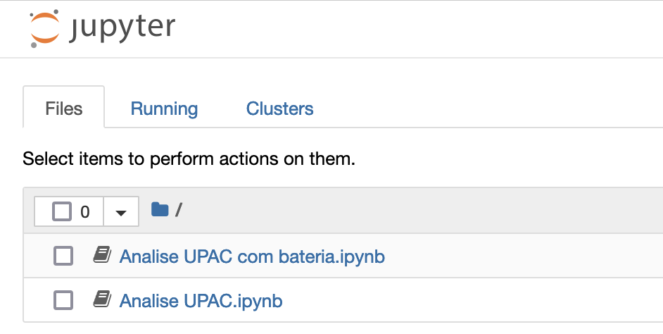

# Instalação

## Pré-instalação

É necessário ter uma distribuição python instalada, este projecto foi desenvolvido com ``python 3.8`` dai recomendar pelo menos essa versão.

As instruções seguintes consideram uma distribuição Anaconda/[Miniconda](https://docs.anaconda.com/miniconda/).

Caso se pretenda obter dados da NEWA (new european wind atlas) é necessário configurar o ambiente para trabalhar com NETCDF. Para tal é necessário instalar
as seguintes bibliotecas nativas:
* HDF5@1.14
* Netcdf@4.9.2

Após a instalação destas pode ser instalada a biblioteca netcdf python que requer estas como dependências. Netcdf é um requisito opcional, mais abaixo é descrito como instalar requisitos opcionais.

## Clonar o reposiório

Através da linha de comandos ou IDE VSCode por exemplo, clonar o repositório para uma localização no disco.

```console
git clone https://github.com/mig-l-f/ao-sol.git
```

Será clonado para pasta ``ao-sol`` no directório actual.

## Instalar

Instruções an linha de comandaos.
Criar um ambiente python 3.8

```console
conda create --name aosol python==3.8.*
```

Activar o ambiente

```console
conda activate aosol
```

Mudar o directório actual para a pasta clonada

```console
cd ao-sol
```

A biblioteca pode ser instalada de 2 modos: ``normal``ou ``editavel``, no último é apenas criado um link para esta pasta e se forem feitas alterações ao código elas serão automaticamente utilizadas. No modo ``normal`` se forem feitas alterações é necessário correr novamente o comando de instalação.

Para instalar em modo ``normal``:

```console
pip install .
```

Para instalar em modo ``editavel``:

```console
pip install -e .
```

Para instalar os requisitos opcionais como ``netcdf``:

```console
pip install .[optional]
```

ou se foi instalado em modo ``editavel``:
```console
pip install -e .[optional]
```

Se der erro tentar tambem utilizar com aspas:
```console
pip install -e ".[optional]"
```

O próximo passo será correr os notebooks.

## Notebooks

O repositório contêm 3 notebooks exemplo na pasta {ref}`Exemplos`:
* **Analise UPAC.ipynb**: Uma UPAC sem bateria baseada em perfil de consumo da eredes.
* **Analise UPAC com bateria.ipynb**: Uma UPAC com bateria baseada em perfil de consumo da eredes.
* **Procura UPAC.ipynb**: Estudo paramétrico de sistemas
com e sem bateria para encontrar o sistema que melhor sistema ao custo mais baixo.

Os perfis de consumo da e-redes podem ser obtidos [aqui](https://www.e-redes.pt/pt-pt/perfis-de-consumo)

Para correr os notebooks podemos utilizar um IDE como o VS Code ou então utilizar o IDE por defeito. Para lançar o IDE por defeito:

```console
cd exemplos
jupyter notebook
```

Deverá aparecer o seguinte no browser:



Escolher por exemplo o Analise UPAC.ipynb. Mais informação sobre os templates no {ref}`Exemplos``

