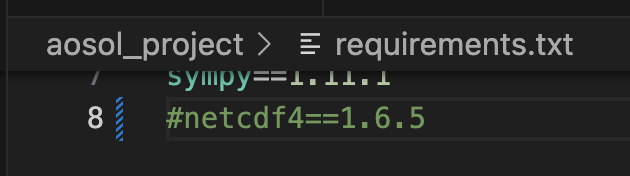

# Instalação

## Pré-instalação

É necessário ter uma distribuição python instalada, este projecto foi desenvolvido com ``python 3.8`` dai recomendar pelo menos essa versão.

As instruções seguintes consideram uma distribuição Anaconda/[Miniconda](https://docs.anaconda.com/miniconda/).

As bibliotecas netcdf e hdf5 é necessária para as funcionalidade NEWA (new european wind atlas), sendo que hdf5 é um pre-requisito da netcdf. À data
das instruções foram testadas as seguintes versões no sistema MacOS:
* HDF5@1.14
* Netcdf@4.9.2

Caso não sejam necessárias as funcionalidades NEWA ou não seja possível instalar estas bibliotecas recomendo que no ficheiro `requirements.txt` se comente a linha com netcdf.



## Clonar o reposiório

Através da linha de comandos ou IDE VSCode por exemplo, clonar o repositório para uma localização no disco.

```console
git clone https://github.com/mig-l-f/ao-sol.git
```

Será clonado para pasta ``ao-sol`` no directório actual.

## Instalar

Instruções an linha de comandaos.
Criar um ambiente python 3.8

```console
conda create --name aosol python==3.8.*
```

Activar o ambiente

```console
conda activate aosol
```

Mudar o directório actual para a pasta clonada

```console
cd ao-sol
```

Instalar as bibliotecas necessárias

```console
pip install -r requirements.txt
```

Neste momento a instalação está concluida. O próximo passo será correr os notebooks.

## Notebooks

O repositório contêm 2 notebooks exemplo na pasta {ref}`Exemplos`:
* **Analise UPAC.ipynb**: Uma UPAC sem bateria baseada em perfil de consumo da eredes.
* **Analise UPAC com bateria.ipynb**: Uma UPAC com bateria baseada em perfil de consumo da eredes.

Os perfis de consumo da e-redes podem ser obtidos [aqui](https://www.e-redes.pt/pt-pt/perfis-de-consumo)

Para correr os notebooks podemos utilizar um IDE como o VS Code ou então utilizar o IDE por defeito. Para lançar o IDE por defeito:

```console
cd exemplos
jupyter notebook
```

Deverá aparecer o seguinte no browser:


Escolher por exemplo o Analise UPAC.ipynb. Mais informação sobre os templates no {ref}`Exemplos``

